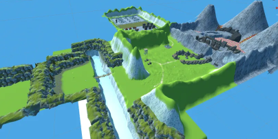

## 무서운 건 싫으니까 마을 구조에 올인 하려고 합니다.

 | 
---|---|

### 프로젝트 개요

플레이어가 맵을 탐방하며 몬스터에게 점령당한 마을을 구조하는 3D RPG 게임입니다.

Unity로 구현한 프로젝트입니다.

### 프로젝트 인원 및 역할

총 5인이 팀으로서 구현하였습니다.

담당 분야는 기획, 플레이어, 보스 몬스터, 맵, 테마 별 몬스터 디자인, NPC 까지 6가지가 있었으며

저의 역할은 

- **맵** 기획 및 특정 장치 구현
- 테마 별 **몬스터 구현**

2가지를 담당했습니다.

### 기여 목록 (기여도: 30 %)

- Terrain 시스템을 이용하여 맵을 제작하였습니다.
- 맵 테마 별 몬스터 (근/원 거리 공격 몬스터) 기능을 구현하였습니다.
    - 몬스터 상태 (경계, 공격, Idle, 피격) FSM 형태로 구현하였습니다.
- Git에서 Merge나 Push 시 Conflict 파일의 잘못된 처리를 복구하였습니다.

### 패키지 버전

Unity 2020.3.21f1